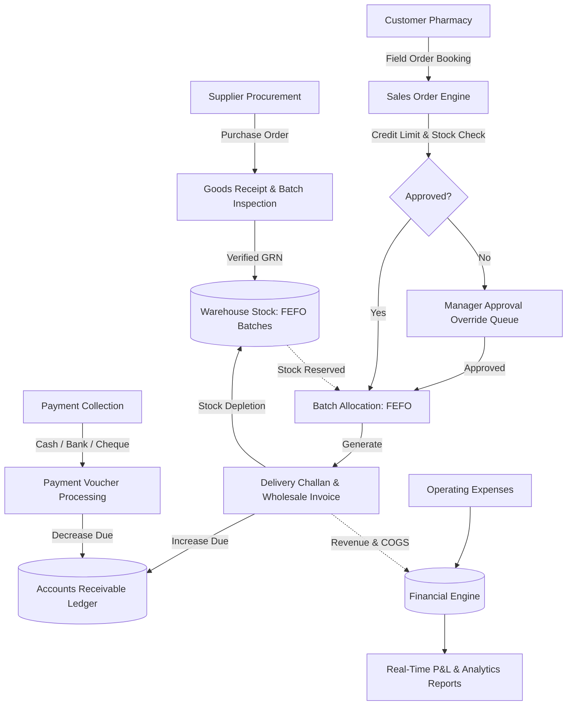
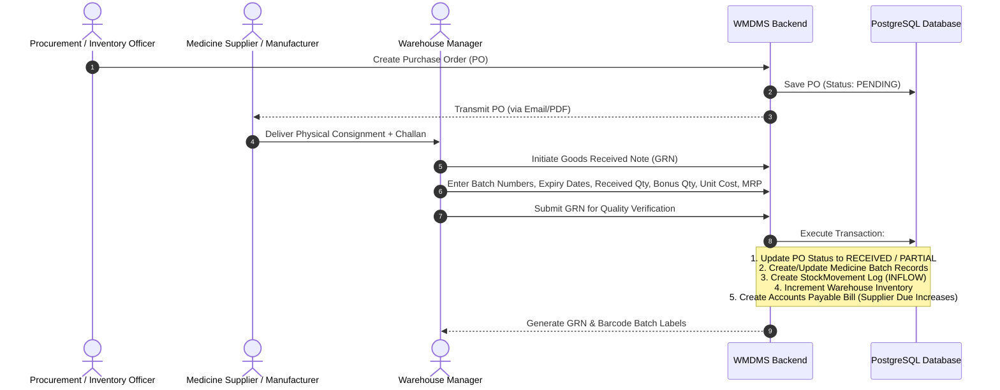
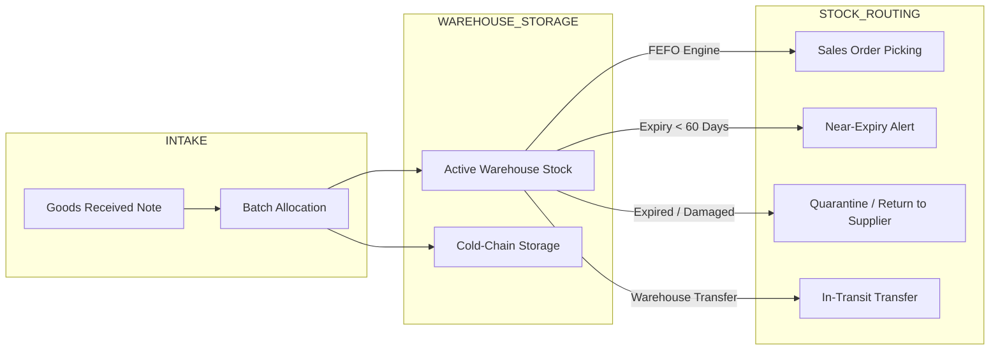
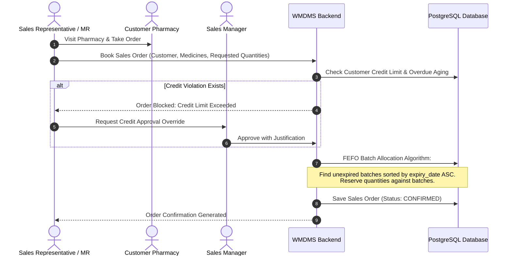
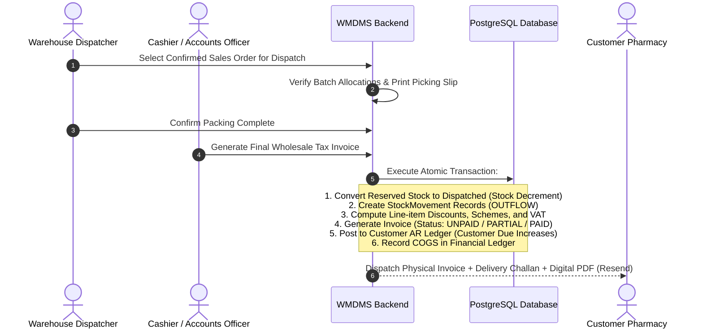
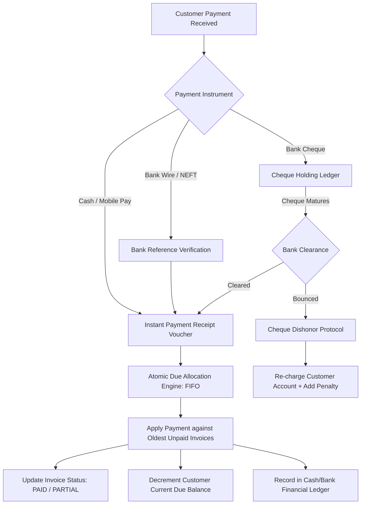
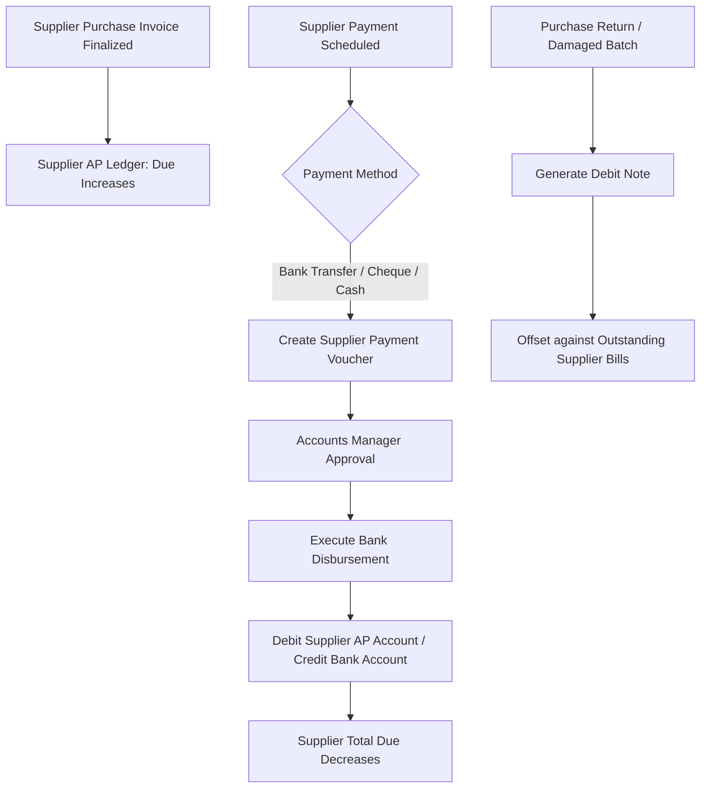
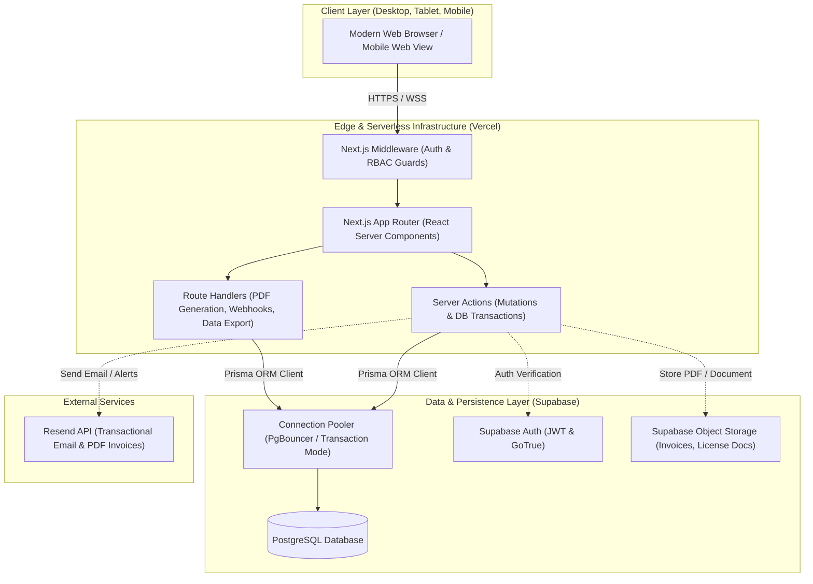
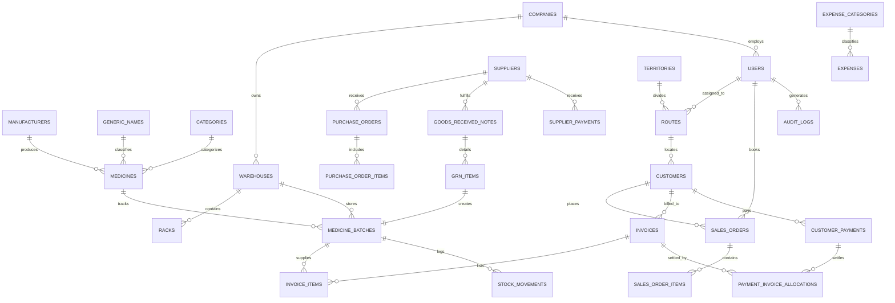
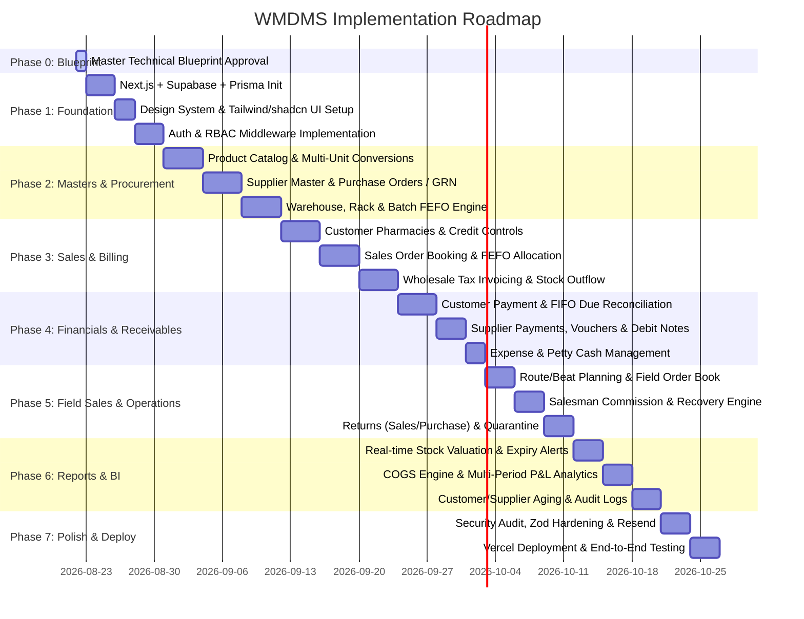

# MASTER ARCHITECTURAL & FUNCTIONAL BLUEPRINT
## Production-Grade Web-Based Wholesale Medicine Distribution Management System
**Document Version:** 1.0.0 (Phase 0 Master Specification)  
**Status:** Approved for Review / Pre-Implementation  
**Target Domain:** B2B Wholesale Medicine & Pharmaceutical Distribution  

---

## 1. Project Overview

The **Wholesale Medicine Distribution Management System (WMDMS)** is an enterprise-grade, web-based B2B Enterprise Resource Planning (ERP) platform architected exclusively for pharmaceutical distributors, stockists, and wholesale drug suppliers. 

Unlike retail pharmacy POS applications that process end-consumer point-of-sale transactions and unit-level pill dispensation, WMDMS is engineered specifically for high-volume, multi-tier pharmaceutical supply chain operations. It manages the entire lifecycle of pharmaceutical distribution: procuring commercial drug lots from manufacturers/suppliers, receiving batch-controlled shipments with verified shelf-life into multi-zone warehouses, maintaining First-Expire, First-Out (FEFO) inventory allocation, orchestrating field sales force routes, serving institutional customers (licensed retail pharmacies, hospital dispensaries, clinics), processing bulk sales orders with complex trade pricing and bonus schemes, enforcing strict customer credit limits, automating multi-method payment reconciliations, and computing precise Gross/Net margins through real-time Cost of Goods Sold (COGS) calculation.

The platform is designed to operate on a modern full-stack TypeScript stack (Next.js App Router, Supabase PostgreSQL, Prisma ORM, Tailwind CSS, and shadcn/ui) deployed on Vercel with high availability, transactional guarantees, and strict regulatory compliance controls.

---

## 2. Business Objectives

1. **Regulatory Compliance & Traceability**: Guarantee end-to-end pharmaceutical traceability across all inventory movements by tracking manufacturer Batch Numbers, Expiration Dates, Drug Regulatory Authority Registration (DAR/NDC) numbers, and temperature-sensitive storage classifications.
2. **FEFO Stock Optimization & Loss Mitigation**: Automate First-Expire, First-Out (FEFO) inventory allocation at the order processing level to drastically minimize financial losses caused by near-expiry and expired pharmaceutical stock.
3. **Credit Risk & Working Capital Control**: Protect cash flow by enforcing automated credit limits, credit duration caps, and aging-based dispatch holds on customer pharmacies, eliminating bad debt exposure.
4. **Transparent Financial Reconciliation**: Maintain double-entry accounting integrity with immutable transaction ledgers for accounts receivable, accounts payable, operating expenses, and tax liabilities.
5. **Accurate Margin & Profit Intelligence**: Calculate real-time batch-specific Cost of Goods Sold (COGS) to deliver authentic Gross Profit and Net Profit visibility at company, category, manufacturer, salesman, and customer pharmacy levels.
6. **Field Sales Force Optimization**: Streamline order booking, delivery verification, payment collection, route management, and commission calculations for Medical Representatives (MR) and delivery staff.
7. **Operational Agility & Zero-Downtime Reliability**: Deliver a lightning-fast web application accessible across desktop and tablet interfaces with sub-second page transitions, transactional safety, and automated daily backups.

---

## 3. User Roles & Access Control Hierarchy

The system enforces a granular **Role-Based Access Control (RBAC)** architecture. Every user belongs to one or more system roles with fine-grained permissions:

```
                  ┌─────────────────────────────────┐
                  │          Super Admin            │
                  └────────────────┬────────────────┘
                                   │
         ┌─────────────────────────┼─────────────────────────┐
         │                         │                         │
┌────────┴────────┐       ┌────────┴────────┐       ┌────────┴────────┐
│  Sales Manager  │       │Warehouse Manager│       │Accounts Officer │
└────────┬────────┘       └────────┬────────┘       └────────┬────────┘
         │                         │                         │
┌────────┴────────┐       ┌────────┴────────┐       ┌────────┴────────┐
│  Salesman / MR  │       │Inventory Officer│       │Cashier / Counter│
└─────────────────┘       └─────────────────┘       └─────────────────┘
```

### Role Profiles:
1. **Super Admin (Owner / Managing Director)**
   - Complete system governance and company configuration.
   - User creation, role assignment, and security audit log access.
   - Master financial oversight: P&L statements, balance sheets, margin overrides.
   - Master entity deletion and critical transaction reversal approval.

2. **Sales Manager**
   - Customer pharmacy verification, onboarding, and credit limit configuration.
   - Territory, route (beat), and sales target management.
   - Sales order approvals, invoice discount override authorization.
   - Sales representative performance and commission reporting.

3. **Medical Sales Representative / Field Salesman (MR)**
   - Assigned route/territory pharmacy directory access.
   - Order booking (quotations/sales orders) on field tablets/smartphones.
   - Customer payment collection entry (cash, cheque, bank transfer).
   - Order status and personal sales target/commission dashboard.

4. **Warehouse Manager**
   - Complete inventory lifecycle governance across multi-warehouse locations.
   - Goods Received Note (GRN) verification and purchase batch intake.
   - Stock adjustments, inter-warehouse transfers, and damaged/quarantine stock write-offs.
   - Expiry management, return-to-supplier authorization.

5. **Inventory Officer / Stock Clerk**
   - Physical rack/shelf stock intake and bin location allocation.
   - Order picking, packing, and dispatch challan verification.
   - Physical stock counting and variance recording.

6. **Accounts Officer / Finance Manager**
   - Supplier purchase bill verification and Accounts Payable (AP) management.
   - Customer ledger reconciliation and Accounts Receivable (AR) management.
   - Operating expense entries, payroll allocation, tax/VAT reporting.
   - Bank reconciliation, cheque clearing/bouncing updates, and P&L auditing.

7. **Cashier / Counter Collection Officer**
   - Daily cash collection, instant receipt generation, and counter invoice settlement.
   - Daily cash book balancing and end-of-day cash drawer handover.

---

## 4. Complete Module List

| # | Module Name | Primary Objective |
|---|-------------|-------------------|
| **M01** | **Authentication & Security** | Supabase Auth, MFA, session management, RBAC, route guards |
| **M02** | **Supplier & Vendor Management** | Supplier directory, manufacturer linkages, payment terms, AP ledgers |
| **M03** | **Product & Medicine Catalog** | Brand, generic name, dosage form, strength, category, unit conversions |
| **M04** | **Purchase & Procurement** | Purchase orders, GRN, batch intake, purchase invoices, purchase returns |
| **M05** | **Warehouse & Inventory** | Multi-warehouse, rack/bin management, batch tracking, FEFO, quarantine |
| **M06** | **Customer Pharmacy Management** | Drug license validation, geo-territory mapping, credit terms, AR ledgers |
| **M07** | **Sales Order & Quotation** | Field order booking, credit limit validation, bonus schemes, picking lists |
| **M08** | **Wholesale Invoicing & Billing** | Invoice generation, batch allocation, trade discounts, VAT, delivery challan |
| **M09** | **Customer Payment & Dues (AR)** | Payment collection, multi-instrument support, due aging, FIFO reconciliation |
| **M10** | **Supplier Payment & Dues (AP)** | Vendor bills, payment vouchers, debit notes, purchase return settlements |
| **M11** | **Distributor & Salesman Operations** | Route planning, beat scheduling, order delivery, commission engine |
| **M12** | **Returns & Claims Management** | Customer sales returns (good/damaged/expired), supplier return claims |
| **M13** | **Expense & Petty Cash** | Operational expense tracking, category budgeting, voucher approvals |
| **M14** | **Financial Accounting & Profit** | COGS engine, gross/net profit computation, chart of accounts, P&L |
| **M15** | **Reports & Business Intelligence** | Real-time tabular & visual analytics (sales, inventory, dues, tax) |
| **M16** | **Audit Trails & System Governance** | Immutable audit logs, change tracking, snapshot backups, system config |

---

## 5. Functional Requirements

### 5.1 Catalog & Product Management
- Hierarchical classification: Category -> Dosage Form (Tablet, Capsule, Syrup, Injectable, Ointment, IV Fluid) -> Generic Name -> Brand Name -> Packaging Specification.
- Multi-tier unit conversion hierarchy (e.g., 1 Master Carton = 20 Inner Boxes; 1 Box = 10 Strips; 1 Strip = 10 Tablets).
- Standard pricing models: Trade Price (TP), Maximum Retail Price (MRP), Wholesale Base Price, Special Institutional Price, Government Tax/VAT rate.
- Temperature and storage conditions (e.g., Room Temp 15-25°C, Cold Chain 2-8°C, Controlled Substance / Narcotics flags).

### 5.2 Purchase & Intake Operations
- Generation of Purchase Orders (PO) with supplier-quoted costs.
- Two-step Goods Received Note (GRN): Physical receiving -> Quality/Batch inspection -> Inventory commitment.
- Mandatory batch metadata recording: Manufacturer Batch Number, Production Date, Expiry Date, Unit Cost, Unit TP, Unit MRP.
- Integration with Accounts Payable: Recording supplier invoices, freight charges, and trade discounts.

### 5.3 Inventory & Warehouse Operations
- Batch-level real-time stock balance tracking with automated FEFO (First-Expire, First-Out) queuing.
- Multi-warehouse and multi-rack/bin location mapping.
- Automated quarantine for expired medicines, damaged goods, or recalled batches.
- Stock adjustments with mandatory audit reason codes (breakage, count discrepancy, quality failure).
- Inter-warehouse transfer workflows with in-transit tracking.

### 5.4 Customer & Credit Management
- Detailed customer profiles: Pharmacy Trade Name, Drug License Number (with expiry), Proprietor Details, Tax ID/TIN, Contact Numbers, Delivery Address, Geolocation/Territory.
- Granular credit control: Maximum Credit Amount, Maximum Due Days (e.g., 30 days), Hard Stop vs Warning Stop on overdue accounts.
- Customer classification (A-tier hospital, B-tier retail pharmacy, C-tier rural clinic) for custom discount matrices.

### 5.5 Wholesale Sales & Invoicing
- Field sales order booking with real-time stock availability check.
- Intelligent Batch Allocation Engine: Automatically selects oldest unexpired batches (FEFO) with manual override capabilities for authorized supervisors.
- Bonus/Scheme Calculation (e.g., "Buy 10 Boxes Get 1 Box Free", "100+5 Scheme") with proper COGS accounting.
- Instant generation of compliant Wholesale Tax Invoices, Delivery Challans, and Gate Passes.
- Full support for partial dispatch, backorders, and multi-batch single line items.

### 5.6 Financials & Accounts Receivable/Payable
- Customer Payment Receipts: Supports Cash, Cheque (with Bank, Branch, Cheque #, Due Date), Bank Transfer (NEFT/RTGS/Wire), and Mobile Financial Services.
- Cheque clearance lifecycle: Received -> Deposited -> Cleared / Bounced (with automated customer balance re-charge and penalty fees).
- FIFO Due Settlement: Automated matching of payments against oldest unpaid invoices or manual line-item settlement.
- Supplier Payment Vouchers with TDS/Withholding Tax deduction support.

### 5.7 Sales Force & Territory Management
- Territory -> Beat/Route -> Pharmacy customer hierarchy.
- Daily beat scheduling for salesmen with GPS/check-in tracking readiness.
- Multi-tier commission structures: Percentage on gross sales volume, percentage on actual cash recovery, bonus incentives on target achievement.

### 5.8 Expense & Operating Cost Tracking
- Categorized expense recording: Salaries, Warehouse Rent, Transport & Logistics, Utilities, Licensing Fees, Marketing, Breakage Losses.
- Multi-level approval for expenses exceeding defined thresholds.
- Direct linking of logistical expenses to specific sales or purchase shipments for landed cost computation.

### 5.9 Profit Intelligence
- Batch-specific Cost of Goods Sold (COGS) tracking.
- Gross Margin calculation: `Invoice Revenue - Cost of Goods Sold (COGS) - Trade Discounts`.
- Net Margin calculation: `Gross Margin - Allocated Operating Expenses - Logistics Overhead`.

---

## 6. Non-Functional Requirements

| Dimension | Standard / Specification |
|---|---|
| **Performance** | Sub-300ms server response for API routes; sub-1s initial page load; sub-50ms query execution on indexed batch lookups. |
| **Concurrency & Integrity** | High concurrency support with Prisma `$transaction` isolation to prevent race conditions during high-volume stock reservation. |
| **Availability** | 99.9% uptime target powered by Vercel Serverless/Edge infrastructure and Supabase Multi-AZ PostgreSQL. |
| **Data Scalability** | Partition-ready schema design capable of processing 1,000,000+ batch transactions annually without degradation. |
| **Security & Privacy** | Role-Based Access Control (RBAC), TLS 1.3 encryption, Row-Level Security (RLS) policies, Zod-sanitized inputs, CSRF/XSS protection. |
| **Auditability** | 100% immutable audit logging for all inventory movements, price edits, invoice cancellations, and ledger settlements. |
| **Usability & UX** | Dense, ergonomic desktop/tablet interface engineered with Tailwind CSS and shadcn/ui for rapid data entry (keyboard navigation, barcode scanning compatibility). |
| **Disaster Recovery** | Point-in-Time Recovery (PITR) with Supabase automated daily backups and write-ahead log (WAL) retention. |

---

## 7. Master Business Rules

1. **Inventory Conservation**:
   - Every physical stock movement MUST be represented by a double-entry inventory transaction (`StockMovement`: Type, BatchID, Quantity, ReferenceType, ReferenceID).
   - Purchase GRN increases stock.
   - Wholesale Invoice dispatch decreases stock.
   - Stock balance can NEVER be negative (`quantity_on_hand >= 0` check constraint).
2. **Sales Stock Validation**:
   - Sales orders cannot be invoiced if the requested quantity exceeds the aggregate available (unreserved, unexpired, non-quarantined) batch stock.
3. **FEFO Enforcement**:
   - Medicines must be allocated in order of earliest expiration date (First-Expire, First-Out).
   - Medicines with shelf-life under minimum threshold (e.g., < 60 days) cannot be sold on standard invoices without explicit supervisor authorization.
   - Expired stock is automatically locked out from sales selection.
4. **Cancellation & Reversals**:
   - Invoices cannot be physically deleted. Cancelled invoices trigger automated reversal transactions: stock is restored to original batches, and customer dues are credited back.
5. **Credit Limit & Due Control**:
   - An order cannot proceed to billing if `Customer.CurrentDue + OrderTotal > Customer.CreditLimit` OR if customer has overdue invoices exceeding `Customer.CreditDays`, unless overridden by a Sales Manager with a cryptographic audit log.
6. **Financial Integrity**:
   - Customer dues increase on credit invoice creation.
   - Customer dues decrease only upon verified payment receipt (or cleared cheque).
   - Supplier dues increase upon Purchase Invoice commitment.
   - Supplier dues decrease upon approved Supplier Payment Voucher disbursement.
7. **Gross & Net Profit Rules**:
   - `Gross Profit = Net Sales Revenue - COGS (Actual Batch Cost * Quantity Sold)`.
   - `Net Profit = Gross Profit - Operating Expenses - Financial Charges`.
   - Free bonus goods (`BonusQty`) have a selling price of 0 but maintain their batch acquisition cost, correctly elevating COGS and reflecting true margins.
8. **Immutability of Historical Ledgers**:
   - Finalized invoices, payment vouchers, and closed financial periods are immutable. Corrections must be executed via Credit Notes, Debit Notes, or Adjustment Vouchers.

---

## 8. Complete System User Flows



---

## 9. Purchase Workflow (Procurement to Warehouse Intake)



### Key Business Validations in Purchase Workflow:
- Expiry date must be in the future (minimum 6 months from receipt date by default).
- Batch number + Medicine ID must be unique per supplier batch entry.
- Unit Purchase Cost cannot exceed Maximum Retail Price (MRP).
- Financial ledger automatically creates a pending Accounts Payable liability for the supplier.

---

## 10. Inventory Workflow (Batch Control, FEFO, Multi-Location)



### Stock Management Principles:
1. **Batch Integrity**: Every single stock unit is tied to a specific `MedicineBatch` record containing:
   - `batch_number`: Manufacturer lot code.
   - `expiry_date`: Standardized date for FEFO sequencing.
   - `cost_price`: Exact unit acquisition cost (used for precise COGS calculation).
   - `trade_price`: Base wholesale price.
   - `mrp`: Maximum consumer retail price.
   - `warehouse_id` & `rack_id`: Physical location.
2. **Dynamic Stock States**:
   - `Physical Stock`: Total units physically located in warehouse.
   - `Reserved Stock`: Units allocated to active, un-dispatched sales orders.
   - `Available Stock`: `Physical Stock - Reserved Stock - Quarantined Stock`.
3. **Quarantine Automation**: Nightly cron job shifts batches reaching expiration date into `QUARANTINE` status, immediately disabling them from sales allocation.

---

## 11. Wholesale Sales Workflow (Order to Delivery)



---

## 12. Wholesale Invoice & Billing Workflow



### Invoice Calculation Rules:
$$\text{Line Subtotal} = \text{Billed Qty} \times \text{Unit Trade Price}$$
$$\text{Line Discount} = \text{Line Subtotal} \times \left(\frac{\text{Discount \%}}{100}\right)$$
$$\text{Taxable Amount} = \sum (\text{Line Subtotal} - \text{Line Discount})$$
$$\text{VAT Amount} = \text{Taxable Amount} \times \left(\frac{\text{VAT \%}}{100}\right)$$
$$\text{Invoice Total} = \text{Taxable Amount} + \text{VAT Amount} + \text{Shipping/Handling} - \text{Special Order Discount}$$

---

## 13. Customer Payment & Due Workflow (Accounts Receivable)



### Key Business Rules for Accounts Receivable:
- **FIFO Auto-Settlement**: Unless specific invoice IDs are designated by the accountant, payments automatically extinguish oldest overdue invoices first.
- **Cheque Non-Finality**: Cheque entries do not reduce official due balance until marked as `CLEARED` by the accounts officer.
- **Audit Trails**: Receipt vouchers generate unalterable sequential voucher numbers (`CR-YYYY-XXXXX`).

---

## 14. Supplier Payment & Due Workflow (Accounts Payable)



---

## 15. Distributor & Salesman Operations Workflow

1. **Territory Mapping**: Customers are grouped into geographic **Beats / Routes** (e.g., *Route North-A: Downtown Pharmacies*).
2. **Daily Beat Execution**:
   - Salesman opens mobile/tablet dashboard to view assigned pharmacies for the day.
   - Visits pharmacy, checks past dues/order history, books new sales order, and collects payments.
3. **Daily Reconciliation & Cash Handover**:
   - At end-of-day, salesman returns to warehouse/office.
   - Handover total collected cash & physical cheques to Cashier.
   - Cashier runs "Salesman Settlement Screen", matches physical money against app records, and signs off.
4. **Commission Engine**:
   - Calculates monthly commissions based on two configurable metrics:
     - **Sales Booking Volume**: $X\%$ on gross delivered sales.
     - **Cash Recovery Rate**: $Y\%$ on actual collected funds within payment terms.

---

## 16. Expense Workflow & Operating Cost Management

1. **Expense Categories**:
   - **Direct Costs**: Inbound freight, packaging materials, cold-chain electricity/fuel.
   - **Indirect Operating Costs**: Warehouse rent, office salaries, vehicle maintenance, marketing, insurance, compliance fees.
2. **Approval Hierarchy**:
   - Tier 1: Small Petty Cash ($< \$100$) $\rightarrow$ Single-step cashier approval.
   - Tier 2: Operational Expenses ($\$100 - \$1,000$) $\rightarrow$ Accounts Manager approval.
   - Tier 3: Capital / Major Expenses ($> \$1,000$) $\rightarrow$ Super Admin approval.
3. **Financial Impact**:
   - Operating expenses flow directly into the monthly Profit & Loss engine to compute Net Profit.

---

## 17. Profit Calculation Workflow

The system implements a rigorous pharmaceutical cost accounting engine:

```
┌────────────────────────────────────────────────────────┐
│               Gross Sales Revenue                      │
│   (Sum of all Invoice Line Items at Billed Price)      │
└───────────────────────────┬────────────────────────────┘
                            │  MINUS: Trade Discounts & Returns
┌───────────────────────────▼────────────────────────────┐
│                Net Sales Revenue                       │
└───────────────────────────┬────────────────────────────┘
                            │  MINUS: Cost of Goods Sold (COGS)
                            │  [Σ (Dispatched Batch Cost Price × Total Qty Sold)]
┌───────────────────────────▼────────────────────────────┐
│                  GROSS PROFIT                          │
└───────────────────────────┬────────────────────────────┘
                            │  MINUS: Direct & Indirect Operating Expenses
                            │  MINUS: Damaged / Expired Stock Write-offs
┌───────────────────────────▼────────────────────────────┐
│                   NET PROFIT                           │
└────────────────────────────────────────────────────────┘
```

---

## 18. Comprehensive Reporting Requirements

The system must provide real-time, exportable (CSV, Excel, PDF) reports across key business domains:

### 18.1 Inventory & Warehouse Intelligence
- **Batch-Wise Stock Valuation Report**: Stock quantities, acquisition cost, trade value, retail value, and potential gross profit margin per batch.
- **Expiry Risk Analysis Report**: Predictive categorization of all stock by expiration window:
  - *Expired* (Immediate Quarantine)
  - *0 - 30 Days* (Critical Emergency Sale / Return to Supplier)
  - *31 - 90 Days* (Near Expiry - Promotion Priority)
  - *91 - 180 Days* (Monitored)
  - *> 180 Days* (Healthy)
- **Fast-Moving vs Slow-Moving Stock (ABC Analysis)**: Classifies inventory based on inventory turnover velocity.
- **Stock Movement Ledger (Bin Card)**: Chronological in/out audit history for any medicine batch.

### 18.2 Sales & Commercial Analytics
- **Daily / Monthly Sales Register**: Detailed itemized sales breakdown with filterable dimensions (Customer, Salesman, Route, Manufacturer).
- **Salesman Target vs Achievement Matrix**: Revenue generated vs quota, cash collected, and earned commission.
- **Product Profitability Ranking**: Identifies top margin contributors and loss-making drug items.

### 18.3 Financial & Credit Reports
- **Customer Due Aging Report**: Standard 30 / 60 / 90 / 120+ days aging buckets with credit limit breach flags.
- **Customer Statement of Account (Ledger)**: Chronological transaction ledger with running due balance.
- **Supplier Due & Payment Ledger**: Outstanding supplier bills, debit notes, and payment schedule.
- **Daily Cash Book & Bank Summary**: Day-end cash intake, bank deposits, expenses paid, and closing balances.
- **Profit & Loss Statement (P&L)**: Dynamic multi-period P&L (Gross Sales, Discounts, COGS, Gross Profit, Operating Expenses, Net Profit).
- **Tax / VAT Collection Report**: Government-compliant input/output VAT ledger.

---

## 19. Notification & Alert System

| Trigger Event | Target Role | Channel | Urgency |
|---|---|---|---|
| **Batch Expiration Threshold Reached** | Warehouse Manager, Super Admin | In-App Dashboard + Resend Email | High |
| **Stock Level < Reorder Point** | Inventory Officer, Purchasing | In-App Notification | Medium |
| **Customer Credit Limit Breached** | Sales Rep, Sales Manager | In-App Alert on Order Entry | High |
| **Customer Invoice Overdue > 30 Days** | Salesman, Accounts Officer | In-App Notification + Weekly Summary | Medium |
| **Bank Cheque Due for Deposit** | Cashier, Accounts Officer | In-App Dashboard Calendar | High |
| **Invoice Generated / Dispatched** | Customer Pharmacy Proprietor | Resend Transactional Email (PDF attached) | Low |
| **Large Expense Approval Request** | Super Admin | In-App Action Item + Email | High |

---

## 20. Authentication Architecture

- **Auth Engine**: Supabase Auth (leveraging GoTrue under the hood) integrated natively with Next.js App Router server utilities (`@supabase/ssr`).
- **Session Management**: Secure, HTTP-only, `SameSite=Lax`, encrypted JWT access and refresh tokens stored in cookies.
- **Multi-Factor Authentication (MFA/2FA)**: Time-based One-Time Password (TOTP) support for privileged administrative roles (Super Admin, Accounts Officer).
- **Password Security**: Enforced complexity rules (minimum 10 characters, uppercase, lowercase, numeric, symbol) with bcrypt/Argon2 hashing handled via Supabase.
- **Session Timeout & Inactivity Locking**: Automatic session revocation after configurable idle periods for point-of-collection terminals.

---

## 21. Authorization & Access Control (RBAC)

Authorization is implemented as a multi-tier security barrier:
1. **Edge/Middleware Route Guarding**: Next.js `middleware.ts` inspects decoded session tokens and rejects unauthorized URL path access before route handlers execute.
2. **Server Action & Route Handler Guards**: Every mutation enforces strict role and permission assertions through reusable security helpers (`assertRole(['SUPER_ADMIN', 'SALES_MANAGER'])`).
3. **Database Row-Level Security (RLS)**: PostgreSQL-level RLS policies safeguard data queries to enforce multi-tenant or role-restricted reads (e.g., Salesmen can only view orders and customers belonging to their assigned territory).

---

## 22. Audit & Traceability Architecture

- **Immutable Audit Log Table (`audit_logs`)**:
  - Captures: `id`, `user_id`, `action` (CREATE, UPDATE, DELETE, OVERRIDE, APPROVE), `entity_name`, `entity_id`, `old_values` (JSONB), `new_values` (JSONB), `ip_address`, `user_agent`, `timestamp`.
- **Zero Hard Deletions**: Critical business records (Invoices, Customers, Medicines, Batches, Vouchers) utilize soft deletes (`deleted_at` timestamp) or state machines (`status: CANCELLED / VOIDED`).
- **Price & Credit Overrides**: Any manual override (e.g., billing above credit limit, granting abnormal discounts) requires a mandatory reason code and generates a high-priority audit record.

---

## 23. Backup & Disaster Recovery Architecture

- **Continuous WAL Archiving**: Point-In-Time Recovery (PITR) supported via Supabase PostgreSQL Write-Ahead Logging.
- **Automated Daily Snapshots**: Full automated daily database backups retained across 30-day sliding windows.
- **Emergency Data Export Utility**: Automated nightly cron job exporting sanitized JSON/CSV snapshots of core operational tables (Inventory Batches, Customer Ledgers, Invoices) to a secure encrypted offsite Supabase Storage bucket.
- **Recovery Time Objective (RTO)**: $< 1\text{ hour}$.
- **Recovery Point Objective (RPO)**: $< 5\text{ minutes}$.

---

## 24. System Security Requirements

- **Input Validation**: 100% of data payloads across Server Actions and API endpoints are validated and sanitized via **Zod** schemas before reaching Prisma/Database layers.
- **SQL Injection Prevention**: Prisma ORM parameterized queries natively eliminate SQL injection risks. Raw SQL queries are forbidden unless strictly necessary and parameterized.
- **Cross-Site Scripting (XSS) & CSRF**: React’s native DOM escaping combined with Next.js Server Action CSRF tokens and standard Security Headers (Content Security Policy, X-Frame-Options, X-Content-Type-Options).
- **Sensitive Data Redaction**: Storage of passwords, API keys, and financial credentials strictly encrypted; logs sanitize customer sensitive records.
- **Rate Limiting**: Critical endpoints (login, password reset, bulk exports) protected via IP and user-based sliding-window rate limiters.

---

## 25. High-Level System Architecture



---

## 26. Next.js Application Architecture & Directory Layout

The application will follow a clean, modular structure leveraging Next.js App Router, React Server Components (RSC), and Server Actions:

```
src/
├── app/
│   ├── (auth)/
│   │   ├── login/
│   │   │   └── page.tsx
│   │   └── forgot-password/
│   │       └── page.tsx
│   ├── (dashboard)/
│   │   ├── layout.tsx                     # Main layout with responsive sidebar, topbar, notifications
│   │   ├── page.tsx                       # Role-aware central dashboard
│   │   ├── medicines/                     # Medicine catalog & master data
│   │   │   ├── page.tsx
│   │   │   ├── new/page.tsx
│   │   │   └── [id]/page.tsx
│   │   ├── inventory/                     # Batch management, FEFO, rack lookup, quarantine
│   │   │   ├── page.tsx
│   │   │   ├── batches/page.tsx
│   │   │   ├── adjustments/page.tsx
│   │   │   └── transfers/page.tsx
│   │   ├── purchases/                     # Supplier POs, GRN, purchase invoices
│   │   │   ├── page.tsx
│   │   │   ├── new-po/page.tsx
│   │   │   ├── grn/page.tsx
│   │   │   └── [id]/page.tsx
│   │   ├── sales/                         # Sales orders, wholesale invoicing, dispatch challans
│   │   │   ├── orders/page.tsx
│   │   │   ├── new-order/page.tsx
│   │   │   ├── invoices/page.tsx
│   │   │   └── [id]/page.tsx
│   │   ├── customers/                     # Customer pharmacies, drug licenses, credit terms
│   │   │   ├── page.tsx
│   │   │   ├── [id]/page.tsx
│   │   │   └── [id]/ledger/page.tsx
│   │   ├── suppliers/                     # Suppliers, manufacturers, AP ledgers
│   │   │   ├── page.tsx
│   │   │   └── [id]/page.tsx
│   │   ├── payments/                      # Customer receipts, supplier vouchers, cheque clearance
│   │   │   ├── customer-receipts/page.tsx
│   │   │   ├── supplier-vouchers/page.tsx
│   │   │   └── cheques/page.tsx
│   │   ├── salesmen/                      # Sales reps, routes/beats, commission management
│   │   │   ├── page.tsx
│   │   │   └── routes/page.tsx
│   │   ├── expenses/                      # Operating expenses, petty cash, category vouchers
│   │   │   └── page.tsx
│   │   ├── reports/                       # Business intelligence, P&L, stock valuation, tax
│   │   │   ├── sales/page.tsx
│   │   │   ├── inventory/page.tsx
│   │   │   ├── financial/page.tsx
│   │   │   └── pnl/page.tsx
│   │   └── settings/                      # System configuration, users, roles, audit logs
│   │       ├── users/page.tsx
│   │       ├── audit-logs/page.tsx
│   │       └── company/page.tsx
│   └── api/
│       ├── reports/export/route.ts        # CSV/Excel/PDF streaming route handlers
│       ├── invoices/[id]/pdf/route.ts     # Dynamic invoice PDF renderer
│       └── webhooks/resend/route.ts       # Email delivery tracking
├── components/
│   ├── ui/                                # shadcn/ui base primitives (Button, Dialog, Table, etc.)
│   ├── layout/                            # App sidebar, header, breadcrumbs, command menu
│   ├── shared/                            # Data tables, filter bars, date-range pickers, stat cards
│   ├── forms/                             # React Hook Form + Zod form wrappers
│   └── modules/                           # Domain-specific components (e.g., BatchSelector, FEFOWarningBadge)
├── lib/
│   ├── prisma.ts                          # Prisma client singleton with connection pooling
│   ├── supabase/                          # Supabase client & server helper instances
│   │   ├── client.ts
│   │   ├── server.ts
│   │   └── middleware.ts
│   ├── validations/                       # Zod validation schemas for every domain entity
│   ├── calculations/                      # Pure financial/inventory math engines (COGS, FEFO, VAT)
│   ├── pdf/                               # PDF generation templates (Invoice, Challan, Statement)
│   └── utils.ts                           # Tailwind merge, currency/date formatters
├── server/
│   ├── actions/                           # Next.js Server Actions grouped by domain
│   │   ├── auth.actions.ts
│   │   ├── medicine.actions.ts
│   │   ├── inventory.actions.ts
│   │   ├── purchase.actions.ts
│   │   ├── sales.actions.ts
│   │   ├── payment.actions.ts
│   │   ├── expense.actions.ts
│   │   └── report.actions.ts
│   └── services/                          # Reusable backend service layer (Transaction wrappers)
├── types/                                 # Shared TypeScript interfaces, DTOs, and Prisma extensions
└── middleware.ts                          # Edge auth & route authorization middleware
```

---

## 27. API Architecture & Server Action Design

### 27.1 Mutation Strategy (Server Actions)
All state-modifying operations (e.g., placing an order, confirming a GRN, posting a payment) are executed via **Next.js Server Actions**. Server Actions provide:
- Strict end-to-end type safety between client forms and backend handlers.
- Encapsulated input validation using Zod schemas (`safeParse`).
- Direct integration with transactional databases via Prisma `$transaction`.
- Automatic cache revalidation using Next.js `revalidatePath` and `revalidateTag`.

### 27.2 Transactional Guarantees Pattern
Every critical multi-table mutation adheres to the following transactional standard:
```
Client Form Submission (React Hook Form)
  │
  ▼
Server Action Handler
  │
  ├── 1. Session & Role Verification
  ├── 2. Zod Schema Validation
  ├── 3. Prisma.$transaction (SERIALIZABLE / READ COMMITTED)
  │      ├── a. Lock affected MedicineBatch rows (SELECT FOR UPDATE)
  │      ├── b. Validate stock availability & non-expired condition
  │      ├── c. Decrement batch quantity / Increment reserved stock
  │      ├── d. Create Invoice & InvoiceItems
  │      ├── e. Create StockMovement audit entries
  │      ├── f. Update Customer CurrentDue balance
  │      └── g. Write immutable AuditLog
  ├── 4. Revalidate Affected Routes
  └── 5. Return Typed Result { success: true, data: { invoiceId } }
```

### 27.3 Route Handlers
Standard `Route Handlers` (`app/api/...`) are reserved strictly for:
- Binary document streaming (Dynamic Invoice PDF generation, Delivery Challans).
- High-volume data exports (Streaming 50,000+ line items to CSV/Excel).
- External incoming webhooks (e.g., Resend email event status callbacks).

---

## 28. Database Architecture & Optimization

### 28.1 Database Engine & Connection Strategy
- **Engine**: Supabase PostgreSQL 15+
- **ORM**: Prisma ORM with connection pooling configured via Supabase PgBouncer / Transaction pooler.
- **Isolation Level**: Read Committed for standard queries; explicit Serializable or row-level locking (`SELECT ... FOR UPDATE`) during batch allocation and stock reduction to prevent race conditions.

### 28.2 Indexing Strategy
To guarantee sub-50ms query performance on multi-million row datasets, the database will maintain targeted composite and partial indexes:
- `medicine_batches(medicine_id, expiry_date, quantity_on_hand)`: High-speed FEFO queries.
- `invoices(customer_id, payment_status, created_at)`: Instant customer due lookups and aging calculations.
- `stock_movements(batch_id, movement_type, created_at)`: Instant bin-card and audit reconstructions.
- `customer_payments(customer_id, payment_date)`: Fast ledger reconciliation.
- `sales_orders(status, salesman_id, created_at)`: Sales team dashboard performance.

### 28.3 Concurrency Control & Data Integrity Constraints
- Database-level `CHECK` constraints (e.g., `quantity_on_hand >= 0`, `unit_price >= 0`, `expiry_date > production_date`).
- Foreign keys with `ON DELETE RESTRICT` on all financial and inventory master entities to prevent accidental cascading data loss.

---

## 29. Database Entities & Conceptual Data Model

Below is the complete conceptual entity relationship specification for the entire system:



### 29.1 Core Master Entities

#### 1. `Company` (System Tenant / Business Profile)
- `id` (UUID, Primary Key)
- `name` (String, e.g., "Apex Pharma Distributors Ltd.")
- `trade_license_no` (String)
- `drug_license_no` (String)
- `tax_id_tin` (String)
- `address`, `phone`, `email`, `logo_url` (Strings)
- `created_at`, `updated_at` (Timestamps)

#### 2. `User` (System Users)
- `id` (UUID, Primary Key, linked to Supabase Auth UID)
- `company_id` (UUID, FK -> Company)
- `name` (String)
- `email` (String, Unique)
- `phone` (String)
- `role` (Enum: `SUPER_ADMIN`, `SALES_MANAGER`, `SALESMAN`, `WAREHOUSE_MANAGER`, `INVENTORY_OFFICER`, `ACCOUNTS_OFFICER`, `CASHIER`)
- `status` (Enum: `ACTIVE`, `INACTIVE`, `SUSPENDED`)
- `created_at`, `updated_at` (Timestamps)

#### 3. `Warehouse` & `Rack`
- **`Warehouse`**: `id`, `company_id`, `name`, `code`, `location_address`, `is_active`, timestamps.
- **`Rack`**: `id`, `warehouse_id` (FK), `rack_code` (e.g., "RACK-A-01"), `zone` (Enum: `GENERAL`, `COLD_CHAIN`, `QUARANTINE`), `description`.

#### 4. `MedicineMaster` (Drug Catalog)
- `id` (UUID, Primary Key)
- `company_id` (UUID, FK)
- `brand_name` (String, e.g., "Napa Extra")
- `generic_id` (UUID, FK -> GenericName, e.g., "Paracetamol + Caffeine")
- `manufacturer_id` (UUID, FK -> Manufacturer, e.g., "Beximco Pharma")
- `category_id` (UUID, FK -> Category, e.g., "Analgesics / Antipyretics")
- `dosage_form` (Enum: `TABLET`, `CAPSULE`, `SYRUP`, `INJECTION`, `OINTMENT`, `SUSPENSION`, `IV_INFUSION`, `DROPS`, `INHALER`, `OTHER`)
- `strength` (String, e.g., "500mg + 65mg")
- `pack_size_description` (String, e.g., "10 x 10 Blister Pack in Box")
- `unit_of_measure` (String, e.g., "BOX")
- `strip_per_box` (Integer, default 10)
- `units_per_strip` (Integer, default 10)
- `dar_number` (String, Drug Administration Registration Code)
- `reorder_level` (Integer, Minimum stock threshold alert)
- `storage_temperature` (Enum: `ROOM_TEMPERATURE`, `COLD_STORAGE_2_TO_8_C`, `CONTROLLED_SUBSTANCE`)
- `is_narcotic` (Boolean, default false)
- `status` (Enum: `ACTIVE`, `DISCONTINUED`)
- `created_at`, `updated_at` (Timestamps)

#### 5. `MedicineBatch` (Batch & Inventory Unit)
- `id` (UUID, Primary Key)
- `medicine_id` (UUID, FK -> MedicineMaster)
- `warehouse_id` (UUID, FK -> Warehouse)
- `rack_id` (UUID, FK -> Rack, Nullable)
- `batch_number` (String, e.g., "BT-2026-X9")
- `production_date` (Date, Nullable)
- `expiry_date` (Date, Indexed for FEFO)
- `purchase_cost_price` (Decimal 12,4 - Acquisition cost per primary unit)
- `trade_price` (Decimal 12,4 - Official wholesale trade price)
- `mrp` (Decimal 12,4 - Maximum retail price)
- `quantity_on_hand` (Integer, Actual units physically in stock)
- `quantity_reserved` (Integer, Units allocated to pending orders)
- `quantity_available` (Computed/Stored: `quantity_on_hand - quantity_reserved`)
- `status` (Enum: `ACTIVE`, `NEAR_EXPIRY`, `EXPIRED`, `QUARANTINED`, `EXHAUSTED`)
- `created_at`, `updated_at` (Timestamps)

#### 6. `StockMovement` (Immutable Bin-Card Ledger)
- `id` (UUID, Primary Key)
- `batch_id` (UUID, FK -> MedicineBatch)
- `movement_type` (Enum: `PURCHASE_GRN`, `SALES_INVOICE`, `SALES_RETURN`, `PURCHASE_RETURN`, `STOCK_ADJUSTMENT_ADD`, `STOCK_ADJUSTMENT_DEDUCT`, `WAREHOUSE_TRANSFER_OUT`, `WAREHOUSE_TRANSFER_IN`, `DAMAGE_WRITE_OFF`)
- `reference_type` (String, e.g., "GRN", "INVOICE", "ADJUSTMENT")
- `reference_id` (UUID, Foreign reference ID)
- `quantity_delta` (Integer, Positive for inflow, Negative for outflow)
- `quantity_before` (Integer)
- `quantity_after` (Integer)
- `unit_cost_price` (Decimal 12,4)
- `created_by` (UUID, FK -> User)
- `created_at` (Timestamp)

---

### 29.2 Commercial & Sales Entities

#### 7. `Customer` (Retail Pharmacy / Client)
- `id` (UUID, Primary Key)
- `company_id` (UUID, FK)
- `pharmacy_name` (String, e.g., "Green Life Model Pharmacy")
- `proprietor_name` (String)
- `drug_license_number` (String, Unique)
- `drug_license_expiry` (Date)
- `tin_number` (String, Nullable)
- `phone` (String, Unique)
- `alternate_phone` (String, Nullable)
- `email` (String, Nullable)
- `address` (Text)
- `route_id` (UUID, FK -> Route)
- `credit_limit` (Decimal 12,2, default 0.00)
- `credit_days_limit` (Integer, e.g., 30 days)
- `current_due` (Decimal 12,2, default 0.00)
- `customer_tier` (Enum: `TIER_A`, `TIER_B`, `TIER_C`, `HOSPITAL_INSTITUTION`)
- `status` (Enum: `ACTIVE`, `BLOCKED_OVERDUE`, `INACTIVE`)
- `created_at`, `updated_at` (Timestamps)

#### 8. `SalesOrder` & `SalesOrderItem`
- **`SalesOrder`**:
  - `id` (UUID, Primary Key)
  - `order_number` (String, Unique, e.g., "SO-2026-00891")
  - `customer_id` (UUID, FK -> Customer)
  - `salesman_id` (UUID, FK -> User)
  - `order_date` (Date)
  - `total_amount` (Decimal 12,2)
  - `status` (Enum: `PENDING_APPROVAL`, `APPROVED`, `ALLOCATED`, `DISPATCHED`, `CANCELLED`)
  - `credit_override_by` (UUID, FK -> User, Nullable)
  - `credit_override_reason` (String, Nullable)
  - `created_at`, `updated_at` (Timestamps)
- **`SalesOrderItem`**:
  - `id`, `sales_order_id` (FK), `medicine_id` (FK), `requested_quantity`, `allocated_quantity`, `bonus_quantity`, `unit_trade_price`, `discount_percent`, `total_amount`.

#### 9. `Invoice` & `InvoiceItem` (Wholesale Tax Bill)
- **`Invoice`**:
  - `id` (UUID, Primary Key)
  - `invoice_number` (String, Unique, e.g., "INV-2026-00452")
  - `sales_order_id` (UUID, FK -> SalesOrder, Nullable)
  - `customer_id` (UUID, FK -> Customer)
  - `salesman_id` (UUID, FK -> User)
  - `invoice_date` (Date)
  - `due_date` (Date)
  - `subtotal_amount` (Decimal 12,2)
  - `discount_amount` (Decimal 12,2)
  - `vat_tax_amount` (Decimal 12,2)
  - `grand_total` (Decimal 12,2)
  - `total_cogs_amount` (Decimal 12,2 - Total Cost of Goods Sold for Margin Tracking)
  - `paid_amount` (Decimal 12,2, default 0.00)
  - `due_amount` (Decimal 12,2)
  - `payment_status` (Enum: `UNPAID`, `PARTIALLY_PAID`, `PAID`, `CANCELLED`)
  - `delivery_status` (Enum: `PACKING`, `OUT_FOR_DELIVERY`, `DELIVERED`, `RETURNED`)
  - `created_by` (UUID, FK -> User)
  - `created_at`, `updated_at` (Timestamps)
- **`InvoiceItem`**:
  - `id`, `invoice_id` (FK), `medicine_id` (FK), `batch_id` (FK -> MedicineBatch), `quantity`, `bonus_quantity`, `unit_cost_price` (Snapshot at billing), `unit_trade_price`, `discount_percent`, `vat_percent`, `line_total`, `line_cogs`.

#### 10. `CustomerPayment` & `PaymentInvoiceAllocation`
- **`CustomerPayment`**:
  - `id` (UUID, Primary Key)
  - `receipt_number` (String, Unique, e.g., "MR-2026-00129")
  - `customer_id` (UUID, FK -> Customer)
  - `collected_by_id` (UUID, FK -> User / Salesman)
  - `payment_date` (Date)
  - `amount` (Decimal 12,2)
  - `payment_method` (Enum: `CASH`, `CHEQUE`, `BANK_TRANSFER`, `MFS_BKASH_NAGAD`)
  - `cheque_number`, `cheque_bank_name`, `cheque_branch`, `cheque_maturity_date` (Strings/Date, Nullable)
  - `cheque_status` (Enum: `NOT_APPLICABLE`, `HOLDING`, `DEPOSITED`, `CLEARED`, `BOUNCED`)
  - `bank_transaction_reference` (String, Nullable)
  - `notes` (String, Nullable)
  - `created_at`, `updated_at` (Timestamps)
- **`PaymentInvoiceAllocation`**:
  - `id`, `payment_id` (FK -> CustomerPayment), `invoice_id` (FK -> Invoice), `allocated_amount` (Decimal 12,2).

---

### 29.3 Procurement & Accounts Payable Entities

#### 11. `Supplier` (Drug Manufacturer / Importer)
- `id` (UUID, Primary Key)
- `company_id` (UUID, FK)
- `name` (String, e.g., "Square Pharmaceuticals PLC")
- `contact_person` (String)
- `phone`, `email`, `address` (Strings)
- `tax_tin`, `drug_license_no` (Strings)
- `credit_period_days` (Integer)
- `current_balance_due` (Decimal 12,2, default 0.00)
- `status` (Enum: `ACTIVE`, `INACTIVE`)

#### 12. `PurchaseOrder` & `PurchaseOrderItem`
- **`PurchaseOrder`**: `id`, `po_number` (Unique), `supplier_id` (FK), `po_date`, `expected_delivery_date`, `total_estimated_amount`, `status` (`DRAFT`, `SENT`, `PARTIAL_RECEIVED`, `COMPLETED`, `CANCELLED`), timestamps.
- **`PurchaseOrderItem`**: `id`, `purchase_order_id` (FK), `medicine_id` (FK), `quantity_ordered`, `unit_cost_price`, `total_amount`.

#### 13. `GoodsReceivedNote (GRN)` & `GRNItem`
- **`GoodsReceivedNote`**: `id`, `grn_number` (Unique), `purchase_order_id` (FK, Nullable), `supplier_id` (FK), `warehouse_id` (FK), `challan_number`, `challan_date`, `received_date`, `invoice_amount`, `paid_amount`, `due_amount`, `received_by_id` (FK -> User), timestamps.
- **`GRNItem`**: `id`, `grn_id` (FK), `medicine_id` (FK), `batch_id` (FK -> MedicineBatch), `batch_number`, `expiry_date`, `quantity_received`, `bonus_quantity`, `unit_cost_price`, `unit_trade_price`, `unit_mrp`, `line_total`.

#### 14. `SupplierPayment`
- `id`, `voucher_number` (Unique), `supplier_id` (FK), `payment_date`, `amount`, `payment_method` (`CASH`, `BANK_TRANSFER`, `CHEQUE`), `bank_reference`, `notes`, `created_by_id` (FK), timestamps.

---

### 29.4 Sales Force, Routes & Territory Entities

#### 15. `Territory` & `Route`
- **`Territory`**: `id`, `company_id`, `name` (e.g., "Dhaka Central Division"), `code`.
- **`Route` (Beat)**: `id`, `territory_id` (FK), `route_name` (e.g., "Dhanmondi-GreenRoad-Beat-1"), `assigned_salesman_id` (FK -> User, Nullable), `delivery_day_of_week` (Enum: `SAT`, `SUN`, `MON`, `TUE`, `WED`, `THU`, `FRI`, `DAILY`).

#### 16. `SalesmanCommission`
- `id`, `salesman_id` (FK -> User), `month_year` (String, e.g., "2026-08"), `total_sales_volume`, `total_cash_recovered`, `commission_sales_amount`, `commission_recovery_amount`, `bonus_amount`, `total_payout`, `status` (`DRAFT`, `APPROVED`, `PAID`).

---

### 29.5 Operating Expenses & Auditing Entities

#### 17. `ExpenseCategory` & `Expense`
- **`ExpenseCategory`**: `id`, `company_id`, `name` (e.g., "Warehouse Utilities", "Staff Salaries", "Delivery Fuel"), `code`.
- **`Expense`**: `id`, `category_id` (FK), `voucher_no` (Unique), `date`, `amount`, `payment_method` (`CASH`, `BANK`), `paid_to`, `description`, `receipt_attachment_url`, `approved_by_id` (FK -> User), timestamps.

#### 18. `AuditLog` (System-Wide Security & Compliance Trail)
- `id` (UUID, Primary Key)
- `user_id` (UUID, Nullable, FK -> User)
- `action` (String, e.g., "CREATE_INVOICE", "OVERRIDE_CREDIT_LIMIT", "WRITE_OFF_EXPIRED_STOCK", "CANCEL_INVOICE")
- `entity_type` (String, e.g., "INVOICE", "MEDICINE_BATCH", "CUSTOMER")
- `entity_id` (String)
- `old_values` (JSONB, Nullable)
- `new_values` (JSONB, Nullable)
- `ip_address` (String, Nullable)
- `user_agent` (String, Nullable)
- `created_at` (Timestamp, Indexed)

---

## 30. Complete Development Phases



---

## 31. Detailed Module Specifications (Deep-Dive Matrix)

### Module M01: Authentication & Security
- **Purpose**: Manage system user identity, multi-factor security, session lifecycles, and RBAC authorization boundaries.
- **Inputs**: User credentials (email/password), MFA TOTP tokens, session refresh cookies.
- **Outputs**: Authenticated JWT sessions, cryptographic authorization tokens, user profile contexts.
- **Main Operations**: Login, Logout, MFA Setup & Verification, Password Reset via Resend, Role Permission Resolution.
- **Business Rules**:
  - Super Admin requires mandatory MFA.
  - Accounts and Cashier sessions expire after 30 minutes of inactivity.
  - Failed logins lock out account for 15 minutes after 5 consecutive attempts.
- **Dependencies**: Supabase Auth, Next.js Middleware, Resend.

---

### Module M02: Supplier & Vendor Management
- **Purpose**: Maintain comprehensive directory of pharmaceutical manufacturers, importers, and stock suppliers with commercial payment terms and accounts payable tracking.
- **Inputs**: Supplier company name, contact person, drug licenses, tax IDs, credit period in days.
- **Outputs**: Supplier profiles, supplier balance ledgers, purchasing history, AP aging summaries.
- **Main Operations**: Register Supplier, Update Commercial Terms, View Supplier Statement, Link Products to Manufacturers.
- **Business Rules**:
  - Supplier cannot be deleted if active purchase orders or outstanding payables exist.
  - Supplier balance increases on finalized Purchase Bills and decreases on Payment Vouchers / Debit Notes.
- **Dependencies**: M01 (Security), M10 (AP Accounting).

---

### Module M03: Product & Medicine Catalog
- **Purpose**: Serve as the single source of truth for all pharmaceutical products, generic classifications, dosage forms, packaging units, and standard pricing rules.
- **Inputs**: Brand Name, Generic Classification, Manufacturer, Dosage Form, Strength, Unit Packaging Conversions (Master Carton -> Box -> Strip -> Tablet), DAR registration code.
- **Outputs**: Product Master Records, pricing tiers, reorder threshold triggers, storage condition requirements.
- **Main Operations**: Create/Edit Drug Master, Configure Packaging Hierarchy, Set Unit Trade Price & MRP, Define Cold-Chain / Narcotic flags.
- **Business Rules**:
  - A medicine cannot be sold without at least one defined primary selling unit.
  - Reorder point triggers automated notifications when cumulative batch stock drops below threshold.
- **Dependencies**: M02 (Manufacturer linkages).

---

### Module M04: Purchase & Procurement (PO & GRN)
- **Purpose**: Manage supplier purchase orders, physical consignment intake, batch inspection, and commercial purchase billing.
- **Inputs**: Supplier ID, Ordered Medicines & Quantities, Manufacturer Batch Numbers, Expiration Dates, Received Quantities, Bonus Quantities, Unit Purchase Costs.
- **Outputs**: Purchase Orders (PO), Goods Received Notes (GRN), Supplier Purchase Bills, Initialized `MedicineBatch` records.
- **Main Operations**: Generate PO, Receive Consignment, Perform Batch Quality/Expiry Verification, Commit GRN to Inventory, Post AP Invoice.
- **Business Rules**:
  - Purchase GRN automatically increments inventory at the batch level.
  - Expiry date cannot be in the past or within 180 days of receipt date.
  - Unit Cost cannot exceed Trade Price or MRP.
  - Operation MUST execute within a database transaction guaranteeing atomic stock and AP updates.
- **Dependencies**: M02 (Supplier), M03 (Catalog), M05 (Warehouse/Inventory).

---

### Module M05: Warehouse, Rack & Inventory Management
- **Purpose**: Orchestrate multi-warehouse stock balances, rack/shelf locations, batch expiration lifecycle, and FEFO allocation.
- **Inputs**: Batch IDs, Warehouse IDs, Rack IDs, Stock Adjustment Reasons, Inter-Warehouse Transfer Requests.
- **Outputs**: Real-time batch balances, bin cards, expiry alert queues, quarantine lists.
- **Main Operations**: Batch Creation/Update, Rack Assignment, Stock Adjustment (Damaged/Discrepancy), FEFO Queue Computation, Quarantine Shift.
- **Business Rules**:
  - Stock quantity can never be negative.
  - Physical movement generates an immutable `StockMovement` row.
  - Expired batches are automatically excluded from sales availability.
- **Dependencies**: M03 (Medicine Catalog), M04 (Purchase Intake).

---

### Module M06: Customer Pharmacy Management
- **Purpose**: Maintain accredited customer pharmacy directory, drug license validity, geolocation/route mapping, and credit risk profiles.
- **Inputs**: Pharmacy Trade Name, Proprietor Name, Drug License Number & Expiry Date, Phone, Address, Assigned Route, Credit Limit Amount, Credit Days.
- **Outputs**: Customer Profiles, Credit Health Status, Customer Ledger (AR), Aging Statements.
- **Main Operations**: Onboard Pharmacy, Validate Drug License Expiry, Adjust Credit Terms, Freeze Overdue Accounts, View Statement.
- **Business Rules**:
  - Expired drug licenses trigger an immediate warning and require re-validation before billing.
  - Customer dues increase on credit sales and decrease on verified payment receipt.
- **Dependencies**: M01 (RBAC), M11 (Territory/Route).

---

### Module M07: Sales Order & Quotation Management
- **Purpose**: Enable field sales representatives and office clerks to book wholesale sales orders with real-time stock and credit validation.
- **Inputs**: Customer ID, Salesman ID, Medicine Line Items & Quantities, Special Discount Requests.
- **Outputs**: Sales Orders (Pending / Approved / Allocated), Picking Slips, Backorder Notices.
- **Main Operations**: Book Order, Validate Credit & Stock, Apply Promotional Bonus Schemes, Trigger Supervisor Override if Credit Breached.
- **Business Rules**:
  - Order quantity cannot exceed available (unreserved, unexpired) stock.
  - Over-credit orders require cryptographic Sales Manager approval.
- **Dependencies**: M05 (Inventory FEFO), M06 (Customer Credit).

---

### Module M08: Wholesale Invoicing & Billing
- **Purpose**: Transform confirmed sales orders into legally compliant wholesale tax invoices, deplete physical inventory, and register accounts receivable.
- **Inputs**: Approved Sales Order ID, Confirmed Batch Allocations, Additional Line Discounts, Delivery Charges.
- **Outputs**: Final Wholesale Tax Invoices, Delivery Challans, Gate Passes, Dispatched Stock Ledger.
- **Main Operations**: Generate Invoice, Allocate Batches via FEFO, Decrement Physical Stock, Record COGS, Generate Printable PDF.
- **Business Rules**:
  - Invoicing decreases physical inventory and increases customer due balance in a single atomic transaction.
  - Free bonus units (`BonusQty`) must be recorded with zero revenue and tracked against batch COGS.
  - Invoices cannot be deleted; cancellations trigger credit notes and stock restorations.
- **Dependencies**: M05 (Inventory), M06 (Customer AR), M07 (Orders), M14 (Financial COGS).

---

### Module M09: Customer Payment & Dues (AR)
- **Purpose**: Process customer payment collections across multiple payment instruments and reconcile outstanding invoice balances.
- **Inputs**: Customer ID, Payment Amount, Payment Method (Cash, Cheque, Bank, MFS), Cheque Details, Target Invoice IDs (optional).
- **Outputs**: Official Money Receipts (MR), Updated Customer Due Balance, Cleared/Bounced Cheque Registers.
- **Main Operations**: Record Payment Receipt, Auto-Allocate via FIFO, Deposit Cheque, Mark Cheque Cleared/Bounced, Reverse Dishonored Payments.
- **Business Rules**:
  - Customer due decreases upon cash payment or confirmed cheque clearance.
  - Bounced cheques reverse invoice settlements, reinstate customer dues, and record bank charge liabilities.
- **Dependencies**: M06 (Customer), M08 (Invoicing), M14 (Financial Accounting).

---

### Module M10: Supplier Payment & Dues (AP)
- **Purpose**: Manage accounts payable disbursements to drug manufacturers and offset purchase returns via debit notes.
- **Inputs**: Supplier ID, Bill References, Payment Amount, Bank/Cash Account.
- **Outputs**: Supplier Payment Vouchers, Debit Notes, Reconciled AP Statements.
- **Main Operations**: Generate Payment Voucher, Apply Debit Notes from Returns, Record Withholding Tax.
- **Business Rules**:
  - Supplier due decreases only upon approved payment voucher disbursement.
- **Dependencies**: M02 (Suppliers), M04 (Purchases).

---

### Module M11: Distributor & Salesman Operations
- **Purpose**: Manage geographic sales territories, daily delivery routes (beats), salesman order booking quotas, and recovery-based commissions.
- **Inputs**: Territory boundaries, Route assignments, Pharmacy beat schedules, Sales & Collection targets.
- **Outputs**: Daily Beat Lists, Salesman Target vs Achievement Dashboards, Monthly Commission Sheets.
- **Main Operations**: Assign Beat, Log Field Order, Reconcile Daily Cash Handover, Calculate Performance Commission.
- **Business Rules**:
  - Commission is calculated on both delivered sales volume and on-time cash recovery.
- **Dependencies**: M06 (Customers), M07 (Orders), M09 (Collections).

---

### Module M12: Returns & Claims Management
- **Purpose**: Handle customer sales returns (good, damaged, near-expiry) and supplier purchase return claims.
- **Inputs**: Invoice ID, Returned Batch IDs & Quantities, Return Reason (Expired, Damaged in Transit, Overstocked).
- **Outputs**: Credit Notes (for customers), Debit Notes (for suppliers), Quarantine Stock Inflow.
- **Main Operations**: Receive Sales Return, Inspect Condition, Return to Active Stock (if good) or Quarantine (if expired/damaged), Issue Credit Note.
- **Business Rules**:
  - Expired or damaged returned goods NEVER return to active stock; they are routed directly to quarantine.
  - Credit note reduces customer due balance.
- **Dependencies**: M05 (Inventory), M06 (Customer AR), M08 (Invoicing).

---

### Module M13: Expense & Operating Cost Management
- **Purpose**: Record all direct logistical and indirect operating expenses to enable authentic Net Profit calculation.
- **Inputs**: Expense Category, Voucher Date, Payee, Amount, Payment Method, Supporting Receipts/Vouchers.
- **Outputs**: Expense Vouchers, Petty Cash Books, Departmental Cost Reports.
- **Main Operations**: Record Expense, Submit for Multi-Tier Approval, Disburse Cash/Bank, Link Logistics Costs to Landed Inventory.
- **Business Rules**:
  - Expenses exceeding configured thresholds require Super Admin approval.
- **Dependencies**: M01 (RBAC), M14 (Financial Accounting).

---

### Module M14: Financial Accounting & Profit Intelligence
- **Purpose**: Compute real-time Cost of Goods Sold (COGS), Gross Profit, Operating Margins, and Net Profit across all business dimensions.
- **Inputs**: Invoice Line Item Cost Snapshots, Net Billed Revenues, Approved Operating Expenses, Inventory Write-offs.
- **Outputs**: Real-time Gross Profit Margin, Net Profit Margin, Product/Manufacturer Profitability, Multi-period P&L.
- **Main Operations**: Calculate Batch COGS, Deduct Operating Overhead, Generate P&L Statements, Balance Sheet overview.
- **Business Rules**:
  - $\text{Gross Profit} = \text{Net Revenue} - \text{Batch COGS}$.
  - $\text{Net Profit} = \text{Gross Profit} - \text{Operating Expenses} - \text{Stock Loss Write-offs}$.
- **Dependencies**: M04 (Purchases), M08 (Invoices), M13 (Expenses).

---

### Module M15: Reports & Business Intelligence
- **Purpose**: Deliver dense, actionable tabular and visual reports for inventory valuation, sales velocity, credit risk, and tax compliance.
- **Inputs**: Date ranges, customer/supplier/product filters, warehouse selections.
- **Outputs**: Interactive TanStack Tables, Recharts visual analytics, CSV/Excel/PDF exports.
- **Main Operations**: Run Expiry Risk Report, Generate Customer Due Aging Matrix, Export Tax Ledger, Visualize Sales Trends.
- **Business Rules**:
  - Financial figures must reconcile 100% with underlying transactional ledgers.
- **Dependencies**: All operational modules (M02 through M14).

---

### Module M16: Audit Trails & System Governance
- **Purpose**: Ensure regulatory compliance, data security, change traceability, and automated backup governance.
- **Inputs**: System mutation events, user session contexts, IP addresses, override requests.
- **Outputs**: Immutable Audit Log Explorer, Backup Verification Reports, Security Breach Alerts.
- **Main Operations**: Capture Mutation Logs, Track Field-Level Diffs, Trigger Offsite Database Backups.
- **Business Rules**:
  - Audit logs are append-only; even Super Admins cannot modify or delete audit rows.
- **Dependencies**: M01 (Auth), Database Triggers / Prisma Middleware.

---

## 32. Verification & Blueprint Acceptance Checklist

- [x] **Clear Distinction from Retail POS**: Pure wholesale pharmaceutical B2B workflow (Supplier -> Purchase -> Batch/FEFO Warehouse -> Sales Rep -> Customer Pharmacy -> Invoicing -> AR Due -> COGS/Profit).
- [x] **Mandatory Technology Stack Preserved**: Next.js (App Router), TypeScript, Tailwind CSS, shadcn/ui, Supabase PostgreSQL, Prisma ORM, Supabase Auth/Storage, Zod, React Hook Form, TanStack Table, Recharts, Resend, Vercel.
- [x] **Prohibited Frameworks Excluded**: No NestJS, Express, MongoDB, or separate backends.
- [x] **Zero Implementation Code in Phase 0**: All 30 required sections provided in comprehensive functional and architectural blueprint format without premature code drafting.
- [x] **Critical Business Rules Addressed**: Complete coverage of FEFO, atomic transactions, inventory conservation, credit limit barriers, FIFO payment reconciliation, and COGS/profit calculations.

---
*End of Phase 0 Master Blueprint. Awaiting user review and formal approval to proceed to Phase 1.*
