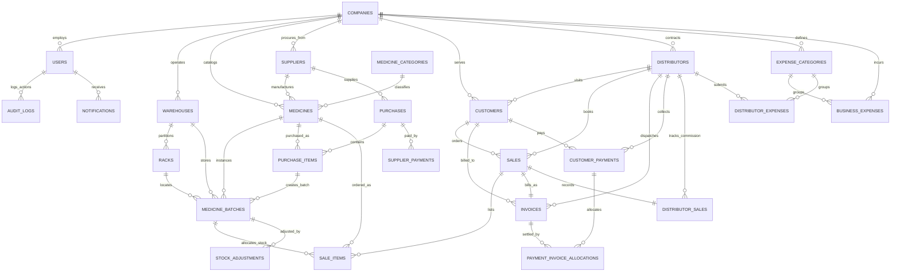

# DATABASE ARCHITECTURE & ENTITY RELATIONSHIP SPECIFICATION
## Wholesale Medicine Distribution Management System (WMDMS)
**Schema Version:** 2.0.0 (Phase 2 Master Database Architecture)  
**Database Engine:** PostgreSQL 15+ (Supabase)  
**ORM:** Prisma ORM v6.19.3  

---

## 1. Executive Database Summary

The database architecture for the **Wholesale Medicine Distribution Management System (WMDMS)** is designed from the ground up to ensure absolute **financial integrity**, **regulatory batch traceability**, and **real-time Cost of Goods Sold (COGS) tracking** across high-volume wholesale pharmaceutical supply chain operations.

### Key Architectural Tenets:
1. **Separation of Medicine and MedicineBatch**: Medicines represent the abstract drug entity (generic, brand, dosage form, packaging ratios), while `MedicineBatch` is the atomic unit of inventory with manufacturer batch number, production date, expiration date, physical stock on hand, and historical acquisition cost.
2. **First-Expire, First-Out (FEFO) Optimization**: Every sale item is bound to a specific batch record. Indexes on `(medicine_id, expiry_date, quantity_on_hand)` enable sub-10ms FEFO queue resolution.
3. **Historical Financial Immutability**: All price and cost snapshots (`unit_cost_price`, `unit_trade_price`, `discount_amount`, `tax_amount`, `line_cogs`) are stored directly on transaction line items (`PurchaseItem`, `SaleItem`, `Invoice`). Future changes to supplier catalog pricing never retroactively alter past financial statements or gross margins.
4. **Strict Decimal Precision**: No `Float` types are used for money. All financial currency values use PostgreSQL `Decimal(14, 2)` (supporting up to 999 billion with 2 decimal places), and unit purchase/trade costs use `Decimal(12, 4)` for micro-fractional accuracy.
5. **No Casual Hard-Deletions**: Financial and inventory entities are preserved using status state machines (`CANCELLED`, `VOIDED`, `DISCONTINUED`) and audit logs.

---

## 2. Complete Entity Relationship Diagram (ERD)

---

## 3. Database Model Catalog & Schema Reference

### 3.1 Tenant & System Administration

#### `Company` (`companies`)
- **Purpose**: System tenant configuration, company licensing (Drug License, Trade License, TIN), and global ERP parameters.
- **Key Fields**:
  - `id`: UUID Primary Key.
  - `name`: Official registered enterprise trading name.
  - `drug_license_no`, `trade_license_no`, `tax_id_tin`: Regulatory compliance identifiers.
  - `default_credit_days`: Default payment grace period for customer pharmacies (default: 30 days).
  - `enable_fefo_strict`: Boolean flag enforcing automated First-Expire, First-Out queue locking.
  - `low_stock_threshold`: Default batch threshold triggering automated reorder notifications.
  - `near_expiry_days`: Window in days (default: 90 days) classifying batches as `NEAR_EXPIRY`.

#### `User` (`users`)
- **Purpose**: System employees and administrative accounts with role-based access control.
- **Key Fields**:
  - `role`: Enum `UserRole` (`SUPER_ADMIN`, `SALES_MANAGER`, `SALESMAN`, `WAREHOUSE_MANAGER`, `INVENTORY_OFFICER`, `ACCOUNTS_OFFICER`, `CASHIER`).
  - `status`: Enum `UserStatus` (`ACTIVE`, `INACTIVE`, `SUSPENDED`).
  - `supabase_auth_id`: Unique foreign identifier linking to Supabase GoTrue Auth UID.

---

### 3.2 Medicine Catalog & Warehouse Inventory

#### `MedicineCategory` (`medicine_categories`)
- **Purpose**: High-level therapeutic and pharmacological classification (e.g., *Analgesics*, *Antibiotics*, *Anti-Ulcerants*, *Cardiovascular*).

#### `Medicine` (`medicines`)
- **Purpose**: Master pharmaceutical drug catalog definition.
- **Key Fields**:
  - `brand_name`: Commercial product trade name (e.g., *Napa Extra*, *Seclo 20mg*).
  - `generic_name`: Active pharmaceutical ingredient (e.g., *Paracetamol 500mg + Caffeine 65mg*).
  - `sku_code`: Unique system stock-keeping code.
  - `dar_number`: Drug Administration Registration code.
  - `dosage_form`: Enum `DosageForm` (`TABLET`, `CAPSULE`, `SYRUP`, `INJECTION`, `OINTMENT`, `SUSPENSION`, `IV_INFUSION`, `DROPS`, `INHALER`, `OTHER`).
  - `unit_of_measure`: Base inventory tracking unit (e.g., `BOX`).
  - `strip_per_box`, `units_per_strip`: Multi-tier packaging conversion ratio hierarchy.
  - `storage_condition`: Enum `StorageCondition` (`ROOM_TEMPERATURE`, `COLD_CHAIN_2_TO_8_C`, `CONTROLLED_SUBSTANCE_NARCOTIC`).
  - `default_trade_price`: Base wholesale trade price per unit of measure.
  - `default_mrp`: Maximum consumer retail price.

#### `Warehouse` & `Rack` (`warehouses`, `racks`)
- **Purpose**: Physical warehouse and bin storage location mapping.
- **Key Fields**:
  - `zone`: Enum `StorageZone` (`GENERAL`, `COLD_ROOM`, `NARCOTICS_SAFE`, `QUARANTINE`).

#### `MedicineBatch` (`medicine_batches`)
- **Purpose**: The atomic source of truth for all inventory movements and FEFO allocation.
- **Key Fields**:
  - `medicine_id`: Foreign key to `Medicine`.
  - `warehouse_id`, `rack_id`: Physical location.
  - `batch_number`: Manufacturer lot/batch identifier.
  - `mfg_date`, `expiry_date`: Manufacturing and expiration dates (indexed for FEFO).
  - `purchase_cost_price`: Exact unit acquisition cost (used for precise COGS).
  - `trade_price`, `mrp`: Pricing snapshot.
  - `quantity_on_hand`: Physical units currently located in warehouse.
  - `quantity_reserved`: Units allocated to confirmed, pending dispatch orders.
  - `quantity_available`: Computed available stock: `quantity_on_hand - quantity_reserved`.
  - `status`: Enum `BatchStatus` (`ACTIVE`, `NEAR_EXPIRY`, `EXPIRED`, `QUARANTINED`, `EXHAUSTED`).

---

### 3.3 Procurement & Accounts Payable (AP)

#### `Supplier` (`suppliers`)
- **Purpose**: Pharmaceutical manufacturers, importers, and stock vendors.
- **Key Fields**:
  - `credit_period_days`: Commercial credit term in days.
  - `opening_balance`, `current_due`, `total_purchased`, `total_paid`: Accounts payable tracking balances.

#### `Purchase` & `PurchaseItem` (`purchases`, `purchase_items`)
- **Purpose**: Supplier purchase orders, physical receiving, and batch intake.
- **Key Fields**:
  - `purchase_number`: Unique sequential identifier (e.g., `PUR-2026-0001`).
  - `grand_total`, `paid_amount`, `due_amount`: Financial liability tracking.
  - `status`: Enum `PurchaseStatus` (`DRAFT`, `ORDERED`, `RECEIVED`, `CANCELLED`).
  - `bonus_quantity`: Free scheme units received from manufacturer.
  - `created_batch_id`: Link to the batch record created or updated by this receipt.

#### `SupplierPayment` (`supplier_payments`)
- **Purpose**: Accounts payable disbursements made to drug manufacturers.
- **Key Fields**:
  - `voucher_number`: Unique voucher code (e.g., `PV-2026-0001`).
  - `payment_method`: Enum `PaymentMethod` (`CASH`, `BANK_TRANSFER`, `CHEQUE`, `MFS_BKASH_NAGAD`).
  - `status`: Enum `PaymentTransactionStatus` (`CONFIRMED`, `VOIDED`).

---

### 3.4 Customers, Sales Force, Wholesale Billing & AR

#### `Customer` (`customers`)
- **Purpose**: Licensed retail pharmacies, hospital dispensaries, and institutional clients.
- **Key Fields**:
  - `pharmacy_name`, `proprietor_name`: Business customer identification.
  - `drug_license_no`, `drug_license_expiry`: Mandatory statutory compliance checks.
  - `credit_limit`: Maximum allowable credit ceiling.
  - `credit_days_limit`: Maximum allowable overdue grace period (e.g., 30 days).
  - `current_due`, `total_purchased`, `total_paid`: Accounts receivable balances.
  - `status`: Enum `CustomerStatus` (`ACTIVE`, `BLOCKED_OVERDUE`, `INACTIVE`).

#### `Distributor` (`distributors`)
- **Purpose**: Medical sales representatives, territory officers, and field salesmen.
- **Key Fields**:
  - `assigned_territory`, `assigned_route`: Geographic beat assignments.
  - `commission_rate_percent`: Standard commission percentage on sales recovery.
  - `monthly_sales_target`: Target sales volume for performance analytics.

#### `Sale` & `SaleItem` (`sales`, `sale_items`)
- **Purpose**: Wholesale sales orders, stock reservation, and batch allocation.
- **Key Fields**:
  - `sale_number`: Unique order code (e.g., `SO-2026-0001`).
  - `total_cogs`: Exact sum of batch acquisition costs for all items in the sale.
  - `status`: Enum `SaleStatus` (`DRAFT`, `CONFIRMED`, `DELIVERED`, `CANCELLED`).
  - `unit_cost_price`: Snapshot of batch purchase cost at the moment of order confirmation.
  - `line_cogs`: `(quantity + bonus_quantity) * unit_cost_price`.
  - `credit_override_approved`: Audit flag if order exceeded customer credit limit.

#### `Invoice` (`invoices`)
- **Purpose**: Legally binding wholesale tax billing document tied 1-to-1 to the completed sale.
- **Key Fields**:
  - `invoice_number`: Unique invoice code (e.g., `INV-2026-0001`).
  - `subtotal_amount`, `discount_amount`, `tax_amount`, `delivery_charge`, `grand_total`: Complete tax breakdown.
  - `paid_amount`, `due_amount`: Outstanding receivable balance.
  - `status`: Enum `InvoiceStatus` (`ISSUED`, `PAID`, `CANCELLED`).

#### `CustomerPayment` & `PaymentInvoiceAllocation` (`customer_payments`, `payment_invoice_allocations`)
- **Purpose**: Customer money receipts and multi-invoice FIFO due settlements.
- **Key Fields**:
  - `receipt_number`: Money receipt identifier (e.g., `MR-2026-0001`).
  - `cheque_status`: Enum `ChequeStatus` (`NOT_APPLICABLE`, `HOLDING`, `DEPOSITED`, `CLEARED`, `BOUNCED`).
  - `allocated_amount`: Specific amount extinguished on target invoice.

#### `DistributorSale` & `DistributorExpense` (`distributor_sales`, `distributor_expenses`)
- **Purpose**: Salesman performance, commission ledger, and daily route expenses.

---

### 3.5 Operational Accounting, Audits & Notifications

#### `ExpenseCategory` & `BusinessExpense` (`expense_categories`, `business_expenses`)
- **Purpose**: Categorized operational cost tracking (warehouse rent, logistics, salaries, utilities).
- **Key Fields**:
  - `is_direct_cost`: Distinguishes direct logistical costs from overhead for margin analysis.
  - `status`: Enum `ExpenseStatus` (`PENDING`, `APPROVED`, `REJECTED`).

#### `StockAdjustment` (`stock_adjustments`)
- **Purpose**: Physical audit discrepancies, damage write-offs, and expired stock expulsions.
- **Key Fields**:
  - `adjustment_type`: Enum `StockAdjustmentType` (`DAMAGE_WRITE_OFF`, `EXPIRY_REMOVAL`, `COUNT_DISCREPANCY_ADD`, `COUNT_DISCREPANCY_DEDUCT`, `RETURN_TO_SUPPLIER`, `SAMPLE_GIVEN`).
  - `quantity_before`, `quantity_delta`, `quantity_after`: Audit-proof quantity ledger.

#### `AuditLog` (`audit_logs`)
- **Purpose**: Immutable security and regulatory audit trail.
- **Key Fields**:
  - `user_id`, `action`, `entity_name`, `entity_id`, `old_values` (JSON), `new_values` (JSON), `ip_address`, `user_agent`, `created_at`.

#### `Notification` (`notifications`)
- **Purpose**: Operational event alerts (Low Stock, Expired Batch, Credit Breach, Cheque Maturity).

---

## 4. Financial Calculation Engine & Margin Integrity

The database schema guarantees authentic financial reporting by segregating Gross and Net profit:

$$\text{Line Subtotal} = \text{Billed Qty} \times \text{Unit Trade Price}$$

$$\text{Line COGS} = (\text{Billed Qty} + \text{Bonus Qty}) \times \text{Historical Unit Cost Price}$$

$$\text{Gross Profit} = \sum (\text{Line Subtotal} - \text{Line Discount}) - \sum (\text{Line COGS})$$

$$\text{Net Profit} = \text{Gross Profit} - \sum (\text{Direct Logistical Expenses}) - \sum (\text{Indirect Operating Expenses}) - \sum (\text{Damage/Expiry Write-offs})$$

### Why Free Bonus Quantities Affect COGS:
When a distributor offers a promotional trade scheme (e.g., *Buy 100 Boxes + Get 5 Free*), the customer is billed for 100 boxes (`revenue = 100 * TP`), but 105 boxes leave the warehouse. The schema records `quantity = 100` and `bonus_quantity = 5`, calculating `line_cogs = 105 * unit_cost_price`. This captures the exact margin compression caused by promotional schemes.

---

## 5. Strategic Indexing Matrix

| Index Name / Fields | Target Model | Business Query Rationale |
|---|---|---|
| `(medicine_id, expiry_date, quantity_on_hand)` | `MedicineBatch` | **FEFO Engine**: Sub-10ms lookup of oldest unexpired batches with positive stock. |
| `(customer_id, payment_status, due_date)` | `Invoice` | **Credit Risk & Aging**: Instant retrieval of overdue invoices for 30/60/90 days aging. |
| `(batch_number)` | `MedicineBatch` | **Regulatory Recall**: Rapid barcode search by manufacturer lot code. |
| `(brand_name, generic_name)` | `Medicine` | **Order Booking Search**: Instant autocomplete during sales rep order entry. |
| `(supplier_id, payment_status)` | `Purchase` | **AP Ledger**: Rapid calculation of total unpaid vendor bills. |
| `(customer_id, payment_date)` | `CustomerPayment` | **Statement of Account**: Fast chronological customer ledger generation. |
| `(entity_name, entity_id, created_at)` | `AuditLog` | **Compliance Audit**: Chronological change history for any individual record. |

---

## 6. Atomic Transaction Boundaries (Prisma `$transaction`)

The schema is built to execute the following core workflows inside ACID database transactions:

### 6.1 Purchase Intake Transaction
1. Insert `Purchase` header with `status: RECEIVED`.
2. Insert `PurchaseItem` records.
3. Upsert `MedicineBatch` rows (increment `quantity_on_hand` and `quantity_available`).
4. Update `Supplier.current_due` and `Supplier.total_purchased`.
5. Insert `AuditLog` record.

### 6.2 Wholesale Sale Booking & Invoicing Transaction
1. Validate `Customer.current_due + OrderTotal <= Customer.credit_limit` (or check `credit_override_approved`).
2. Query batches via FEFO (`expiry_date ASC`) and lock candidate rows with `SELECT FOR UPDATE`.
3. Decrement `MedicineBatch.quantity_on_hand` and increment `quantity_reserved`.
4. Snapshot `unit_cost_price` into `SaleItem` to preserve historical COGS.
5. Create `Sale` and `Invoice` records.
6. Increment `Customer.current_due` and `Customer.total_purchased`.
7. Insert `DistributorSale` commission tracking row.
8. Insert `AuditLog` record.

### 6.3 Sale Cancellation & Stock Restoration Transaction
1. Assert `Sale.status == CONFIRMED`.
2. Iterate `SaleItem` records and restore `quantity_on_hand` to original batches.
3. Update `Sale.status = CANCELLED` and `Invoice.status = CANCELLED`.
4. Decrement `Customer.current_due` by the uncollected invoice balance.
5. Mark `DistributorSale.is_settled = false`.
6. Insert `AuditLog` record with cancellation reason.

---

## 7. Soft Deletion & Cancellation Policy

| Entity Type | Deletion Strategy | Rationale |
|---|---|---|
| **Invoices / Sales** | `status: CANCELLED` (No physical delete) | Must preserve sequential tax invoice numbering and audit traceability. |
| **Payments / Vouchers** | `status: VOIDED` (No physical delete) | Financial audit trail requires permanent record of dishonored/voided receipts. |
| **Medicine Batches** | `status: EXHAUSTED / QUARANTINED` | Batches with historical sales cannot be removed due to foreign key integrity. |
| **Customers / Suppliers** | `status: INACTIVE` | Deactivating prevents new orders while preserving historical ledger balances. |
| **Medicines / Categories** | `status: DISCONTINUED` | Discontinued drugs remain visible on past invoices and reporting registers. |
