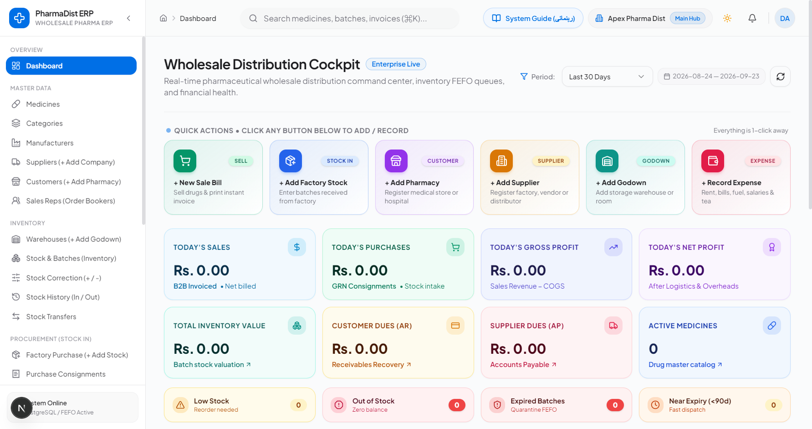
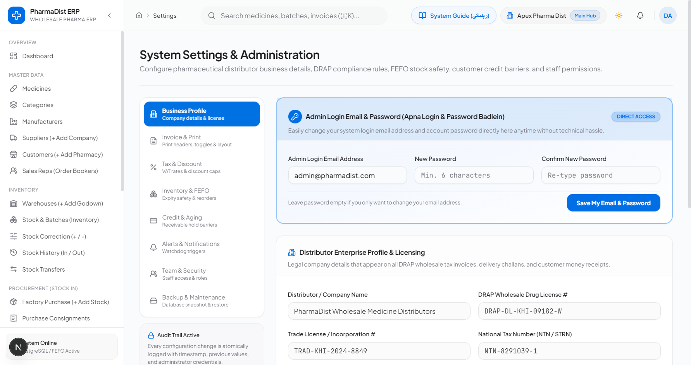
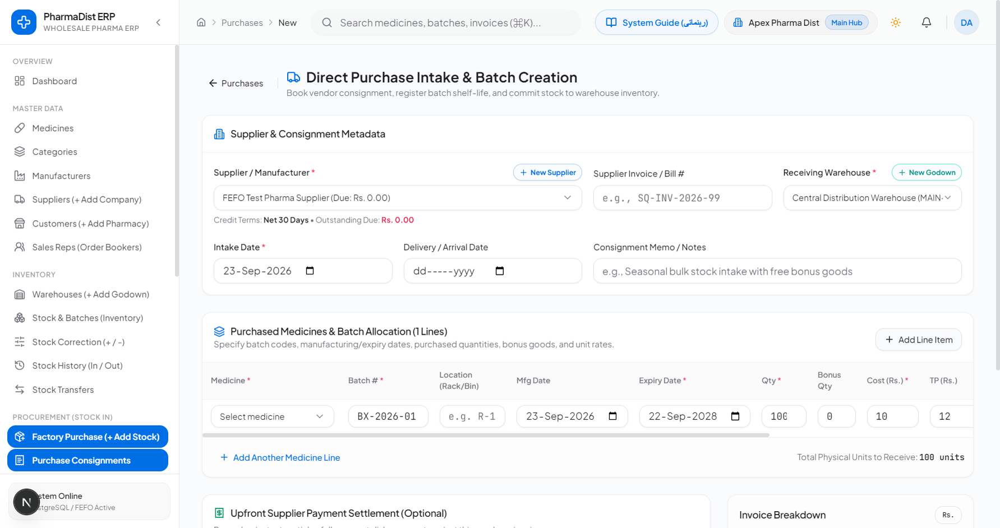
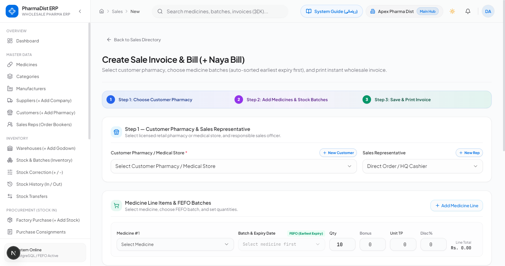
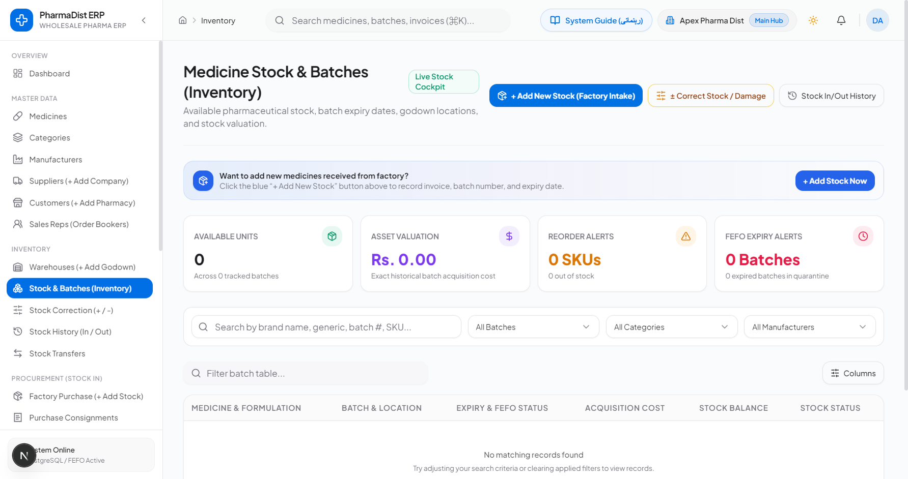
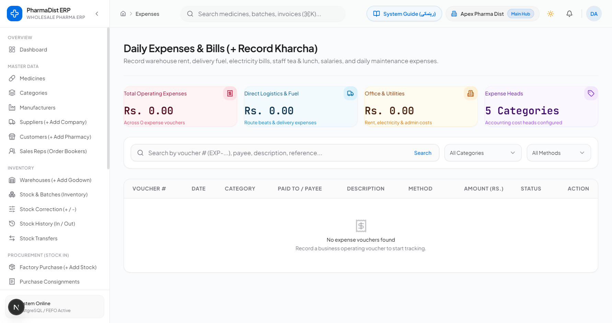

# PharmaDist ERP — Easy English User Manual

A simple, step-by-step visual operating guide designed for pharmaceutical wholesale distributors, warehouse supervisors, and order booking clerks.

---

## 1. Dashboard & 6 Quick Action Buttons
When you log into the ERP, the Wholesale Distribution Cockpit displays 6 colorful quick action cards at the top:

| Button | Color | Purpose |
| :--- | :--- | :--- |
| **+ New Sale Bill** | 🟢 Green | Sell medicines to customer pharmacies & print instant invoice |
| **+ Add Factory Stock** | 🔵 Blue | Enter shipments received from factories with batches and expiries |
| **+ Add Pharmacy** | 🟣 Purple | Register new client pharmacies, clinics, and medical stores |
| **+ Add Supplier** | 🟠 Amber | Register drug manufacturers and pharmaceutical suppliers |
| **+ Add Godown** | 🟢 Teal | Add storage warehouses, rooms, or cold chain storage |
| **+ Record Expense** | 🔴 Red | Record daily operating expenses (rent, electricity, fuel, tea) |

---

## 2. How to Change Your Admin Email & Password
Self-service directly in Settings without technical assistance:
1. Click **System Settings** at the bottom of the left sidebar.
2. The top card on Tab 1 is **"Admin Login Email & Password (Apna Login & Password Badlein)"**.
3. Type your new email address.
4. Type your new password into **New Password** and **Confirm New Password** (minimum 6 characters).
5. Click **"Save My Email & Password"**. Your new credentials are active immediately!

---

## 3. Entering Factory Stock (Purchase Intake & Batches)
When pharmaceutical shipments arrive:
1. Click the blue card **+ Add Factory Stock** on the Dashboard.
2. Select the **Supplier** (If not listed, click the inline `+ New Supplier` button to create it in 10 seconds!).
3. Select the **Godown / Warehouse** (an inline `+ New Godown` button is also available).
4. Enter the manufacturer's **Invoice Number**.
5. Select the medicine, enter the **Batch Number** (e.g. BX-2026-01), choose the **Expiry Date** from the calendar, and specify received quantity, bonus, cost price (Cost Rs.), and wholesale trade price (TP Rs.).
6. Click **Save & Receive Factory Stock**. Stock is instantly committed to warehouse inventory!

---

## 4. Selling Medicines & Automatic FEFO Allocation
How to invoice medicines in 3 steps:
1. **Step 1:** Select Customer Pharmacy (Click `+ New Customer` if registering for the first time). Choose Sales Representative.
2. **Step 2:** Select Medicine. **The system automatically picks the batch expiring earliest** (highlighted by the green `FEFO (Earliest Expiry)` badge). Enter quantity.
3. **Step 3:** Click the green **Create & Print Sale Invoice** button. A DRAP wholesale tax bill and vehicle delivery challan will open ready for printing!

---

## 5. Stock Inspection & Corrections (Damaged Goods)
Navigate to **Stock & Batches (Inventory)**:
- **Broken / Expired Goods:** Click the amber **± Correct Stock / Damage** button, select medicine and batch, set quantity to `-2`, and submit. Inventory updates immediately.
- **Expiry Alerts:** Batches nearing expiry within 90 days appear in the **Near Expiry** alert box so you can sell them at promotional rates or initiate return-to-vendor (RTV).

---

## 6. Recording Daily Operating Expenses
- Click the red card **+ Record Expense** on the Dashboard.
- Choose category (Rent, Electricity, Delivery Fuel, Tea, Salaries).
- Enter amount (Rs.) and save. The expense is deducted from your daily gross profit to compute true **Today's Net Profit**.

---

## 7. Daily Routine & Schedule (Standard Operating Procedure)
- **Morning (08:00 - 09:00):** Review Dashboard for Low Stock and Near Expiry alerts. Print recovery sheets for sales reps.
- **Daytime:** Process factory stock intakes with **+ Add Factory Stock** and book sales with **+ New Sale Bill**.
- **Evening Closing (17:00 - 18:00):** Record money collected by salesmen under *Collections & Receipts*. Log daily expenses with **+ Record Expense**. Verify **Today's Net Profit** before closing!
